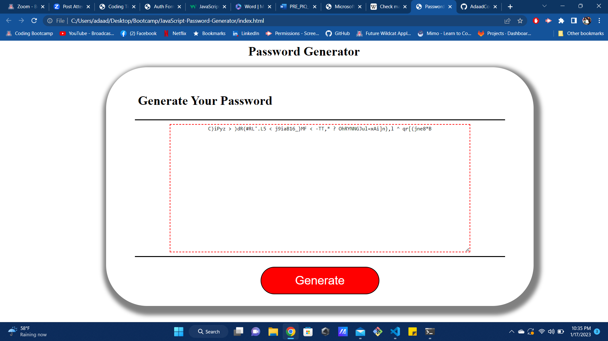

# JavaScript-Password-Generator
Using prompts, I was able to make a interactive website using JavaScript.

## Description
This page will allow users to generate a random password using prompts to determine what kind of password the user would want to be created.

Deployed Website: https://adaadcontreras.github.io/JavaScript-Password-Generator/

